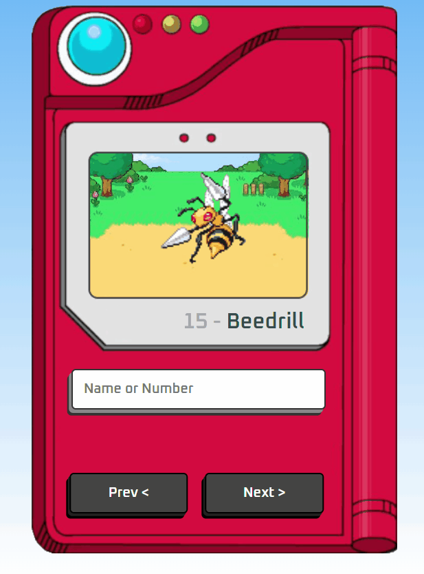
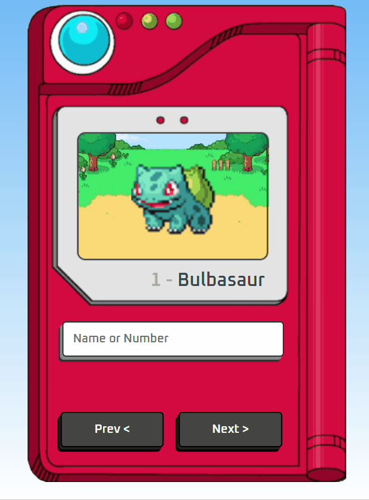
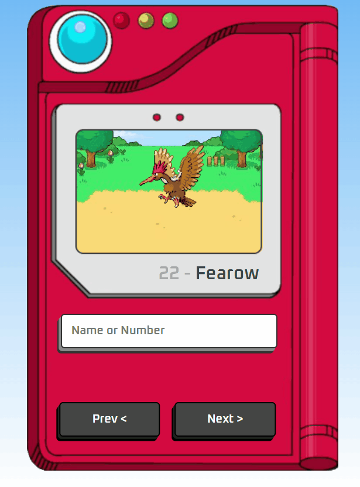

<h1 align="center">
 
  
  
  
  
</h1>
 

 

Design of a pokedex using html, css and java script, fully responsive project from mobile to desktop. in the application we have several ways to search for pokemons and we also use an api.

